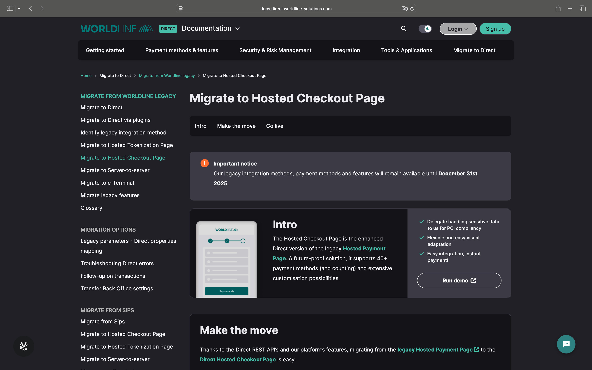

# WordPress Pay Gateway: Ingenico/Ogone

**Ingenico/Ogone driver for the WordPress payment processing library.**

---

An important notice from Worldline, the current owner and operator of the Ogone and Ingenico solutions:

> [!IMPORTANT]  
> Our legacy [integration methods](https://support.legacy.worldline-solutions.com/en/integration-solutions/), [payment methods](https://support.legacy.worldline-solutions.com/en/payment-methods/ "nav.payment_methods") and [features](https://support.legacy.worldline-solutions.com/en/security/fraud-prevention/fraud-expert-scoring) will remain available until **December 31st 2025**.

For merchants looking to migrate from the legacy Ogone or Ingenico integrations, we recommend using the [**Worldline – Direct – Hosted Checkout** integration](https://github.com/pronamic/pronamic-pay-worldline-direct-hosted-checkout) included in [Pronamic Pay Premium](https://www.pronamic.shop/product/pronamic-pay-premium/). This integration provides a secure and modern payment experience for WordPress and WooCommerce, ensuring compatibility with current Worldline services and continued support beyond December 31, 2025.

---

## Production Environment

**Dashboard URL:** https://secure.ogone.com/ncol/prod/backoffice  
**Payment Server URL:** https://secure.ogone.com/ncol/prod/orderstandard.asp  

## Test Environment

**Dashboard URL:** https://secure.ogone.com/ncol/test/backoffice  
**Payment Server URL:** https://secure.ogone.com/ncol/test/orderstandard.asp  

## Documentation

*	[Integrate with Ogone e-Commerce](http://payment-services.ingenico.com/en/ogone/support/guides/integration%20guides/e-commerce)
	*	[What is an SHA signature/passphrase?](http://payment-services.ingenico.com/ogone/support/guides/gebruikersgidsen/shopping-carts/what-is-an-sha-passphrase)
		*	[SHA-IN - Security: pre-payment check](http://payment-services.ingenico.com/en/ogone/support/guides/integration%20guides/e-commerce/security-pre-payment-check)
		*	[SHA-OUT - Transaction feedback](http://payment-services.ingenico.com/en/ogone/support/guides/integration%20guides/e-commerce/transaction-feedback)
